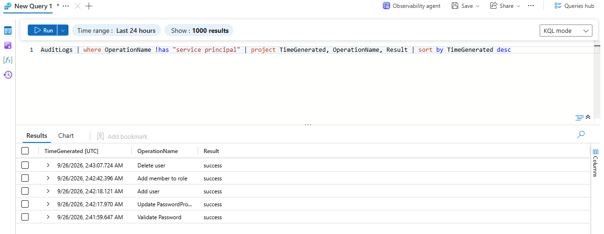

# Microsoft Sentinel Detection Lab

Three detection rules built in Microsoft Sentinel that catch privileged account abuse in Microsoft Entra ID. Each one is mapped to MITRE ATT&CK and was tested against real audit data in a live Azure tenant.

I built this to get hands-on SIEM experience: setting up a data connector, writing KQL, creating analytics rules, and tuning them when they misbehaved.

---

## Setup

| Component | Detail |
|---|---|
| SIEM | Microsoft Sentinel (Defender XDR portal) |
| Log source | Microsoft Entra ID Audit Logs |
| How data gets in | Entra diagnostic setting to a Log Analytics workspace |
| Query language | KQL |
| Rules | Scheduled query rules, running every 5 minutes |

I did not use sign-in logs. Exporting them requires an Entra ID P1 or P2 license, so all three rules are built on audit logs only, which are free. That is a real constraint a lot of smaller organizations run into.

The test case for all three rules is one sequence of audit events: an account created, given an admin role 24 seconds later, and deleted 25 seconds after that.

---

## Rule 1: Privileged Role Assignment

**Privilege Escalation · T1098 Account Manipulation · Medium**

**What I'm looking for:** Someone granting an admin role to an account. If an attacker takes over an account that can edit the directory, the first thing they do is give themselves or a burner account real permissions. That gets written to the audit log every time.

```kql
AuditLogs
| where OperationName has "Add member to role"
| extend Actor = tostring(InitiatedBy.user.userPrincipalName)
| extend Target = tostring(TargetResources[0].userPrincipalName)
| extend RoleName = tostring(TargetResources[0].modifiedProperties[1].newValue)
| project TimeGenerated, OperationName, Actor, Target, RoleName, Result
```

Entities mapped: `Target` and `Actor`, both as Account.

**Result:** Caught a User Administrator assignment and correctly pulled out who did it and who received it.

**False positives:** This fires on every normal onboarding and every helpdesk role grant. To be useful in production it needs an allowlist for the accounts that do provisioning, or it should only watch high-value roles like Global Administrator instead of all roles.

---

## Rule 2: New Account Rapid Privilege Escalation

**Persistence · T1136 Create Account · High**

**What I'm looking for:** An account that gets created and then immediately elevated. Real onboarding usually has hours or days between those two steps, plus an approval somewhere. An attacker does both in the same sitting.

```kql
let roleGrants = AuditLogs
| where OperationName has "Add member to role"
| extend Target = tostring(TargetResources[0].userPrincipalName)
| extend RoleName = tostring(TargetResources[0].modifiedProperties[1].newValue)
| project GrantTime = TimeGenerated, Target, RoleName;
AuditLogs
| where OperationName has "Add user"
| extend Target = tostring(TargetResources[0].userPrincipalName)
| project CreateTime = TimeGenerated, Target
| join kind=inner roleGrants on Target
| extend MinutesToEscalation = datetime_diff('minute', GrantTime, CreateTime)
| where MinutesToEscalation between (0 .. 60)
| extend TimeGenerated = GrantTime
| project TimeGenerated, CreateTime, GrantTime, MinutesToEscalation, Target, RoleName
```

This one builds a list of role grants, builds a list of account creations, matches them on the account name, and keeps any pair that happened within an hour of each other.

Entity mapped: `Target` as Account.

**Result:** Caught the test account being created and given User Administrator 24 seconds later.

**Something the test data showed me:** The time gap came back as `0` minutes. 24 seconds rounds down to zero, which means minutes are too coarse a unit for the thing I'm actually hunting. The fix is to measure in seconds and alert on anything under 300.

**False positives:** Automated provisioning. If HR software creates an account and assigns a role in the same API call, it looks exactly like this. Excluding that service account is the first thing you'd tune.

---

## Rule 3: Password Reset on Privileged Account

**Persistence · T1098 Account Manipulation · Medium**

**What I'm looking for:** Someone resetting the password on an admin account. That does two things at once. It gives the attacker access and it locks out the person who is supposed to have it.

```kql
let privilegedAccounts = AuditLogs
| where OperationName has "Add member to role"
| extend Target = tostring(TargetResources[0].userPrincipalName)
| distinct Target;
AuditLogs
| where OperationName has_any ("Reset password", "Update PasswordProfile", "Change user password")
| extend Target = tostring(TargetResources[0].userPrincipalName)
| extend Actor = tostring(InitiatedBy.user.userPrincipalName)
| where Target in (privilegedAccounts)
| project TimeGenerated, OperationName, Actor, Target, Result
```

Entities mapped: `Target` and `Actor`, both as Account.

**Result:** Caught the password operation on the account that had been elevated earlier.

**Weakness in this one:** I build the list of privileged accounts from the audit log itself. That only includes accounts that got elevated while logging was turned on. Anyone who was already an admin before that is invisible to this rule. In a real environment you would pull that list from the directory or from a Sentinel watchlist instead.

---

## Tuning: 17 incidents from 3 events

Within an hour of turning the rules on, the queue had 17 incidents. There were only 3 real events behind them.

The problem was the schedule. I set each rule to run every 5 minutes but look back 1 hour. So every run re-read the same events and opened a brand new incident for something it had already alerted on. Same three events, twelve times over.

This is alert fatigue in miniature. A queue full of duplicates is how analysts learn to stop reading the queue.

Three ways to fix it:

| Fix | Downside |
|---|---|
| Make the lookback match the schedule (5 min and 5 min) | Anything delayed by ingestion lag falls outside the window and gets missed |
| Turn on alert grouping by account | Repeats collapse into one incident, detection still works |
| Turn on suppression after an alert fires | Standard in production, but the rule is blind while suppression is active |

The obvious fix is the wrong one, and the reason is lag. The first batch of audit events took about two hours to show up after I configured the export, and 5 to 15 minutes once it was warmed up. A 5-minute lookback would have quietly dropped all of them.

---

## Things I learned building this

**The data is buried in JSON.** Audit log fields like the actor and the target are not normal columns. They sit inside nested JSON objects, so you have to walk into them with dot notation and convert them with `tostring()` before you can use them.

**Array positions are not safe.** `modifiedProperties[1]` happens to be the role name in my tenant. That position is not guaranteed. A production rule should expand that array and filter on the field name instead of trusting an index.

**A green connector does not mean data is flowing.** My Entra connector showed as connected, and the `AuditLogs` table existed in KQL, but every query returned nothing. The connector creates a diagnostic setting inside Entra, and that setting has two separate parts: which logs to send, and where to send them. Mine had the logs picked but no destination attached. If a table exists and returns zero rows, the problem is on the source side, not in your query.

**Entra does not backfill.** Logging only exports forward from the moment you set it up. My first round of test events happened before the destination was wired and they are gone permanently. I had to redo them.

**The actor field caught something real.** It resolved to a guest account rather than the native admin account I thought I was using, which meant two different identities had privileged access in the tenant. That is exactly the kind of thing this rule exists to surface.

---

## How to rebuild this

1. Create a Log Analytics workspace and attach Microsoft Sentinel
2. Install the Microsoft Entra ID solution from Content hub
3. Configure the data connector and enable Audit Logs
4. Go to Entra ID, then Diagnostic settings, and confirm the setting has both a log category picked and a Log Analytics destination attached
5. Generate events: create a user, give it a privileged role, delete it
6. Wait for ingestion. Allow up to two hours the first time
7. Check with `AuditLogs | take 10` in KQL mode
8. Build the rules with the queries above, map the entities, tag the MITRE techniques
